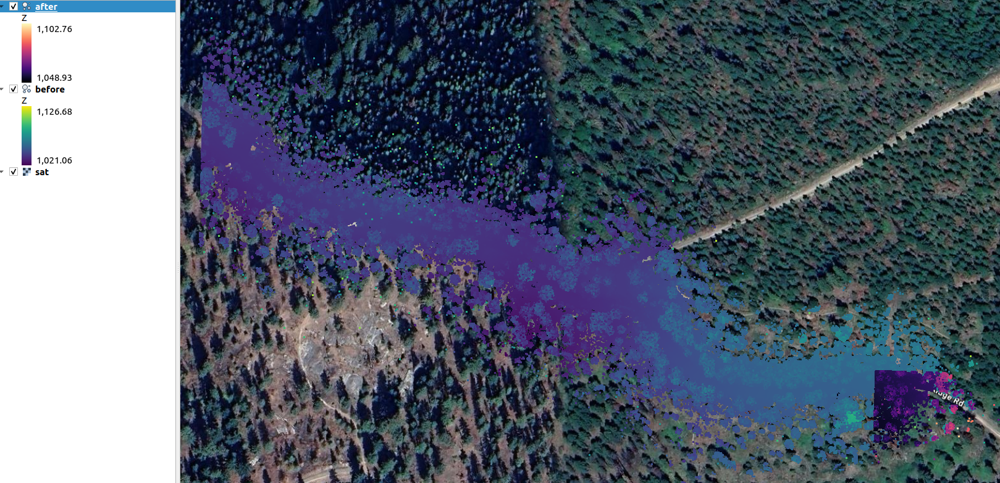
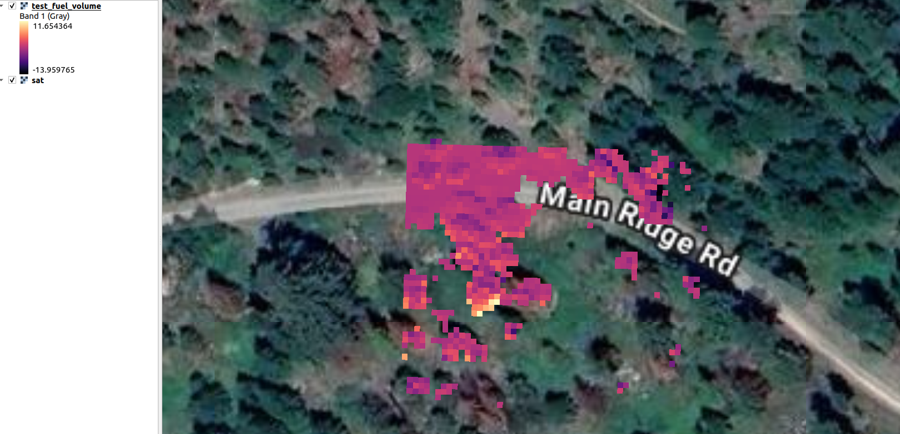
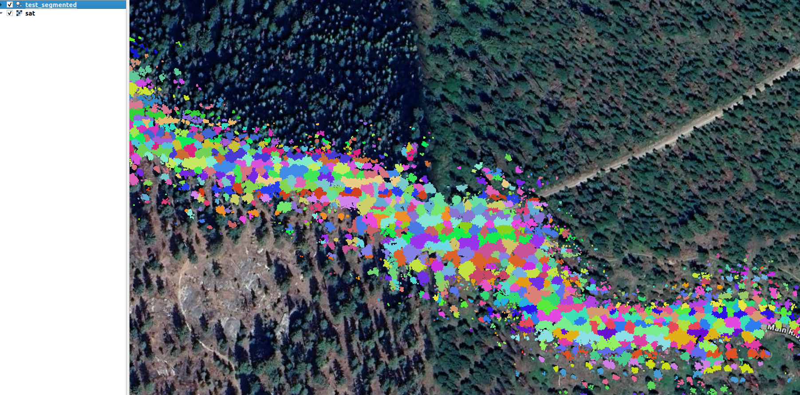
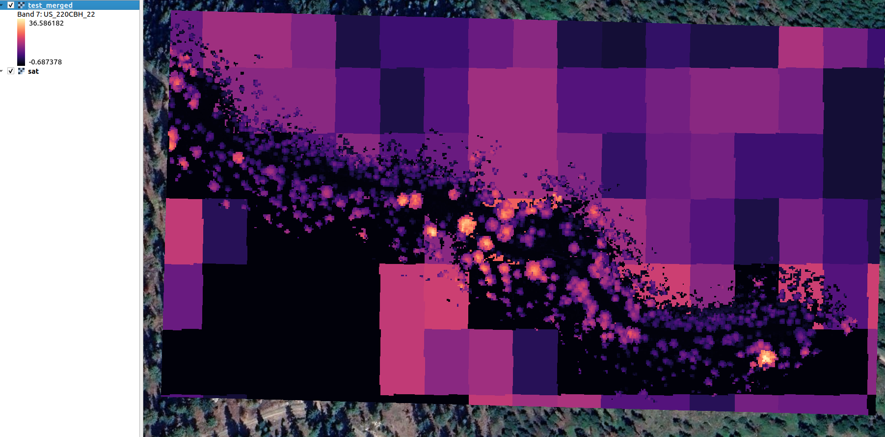
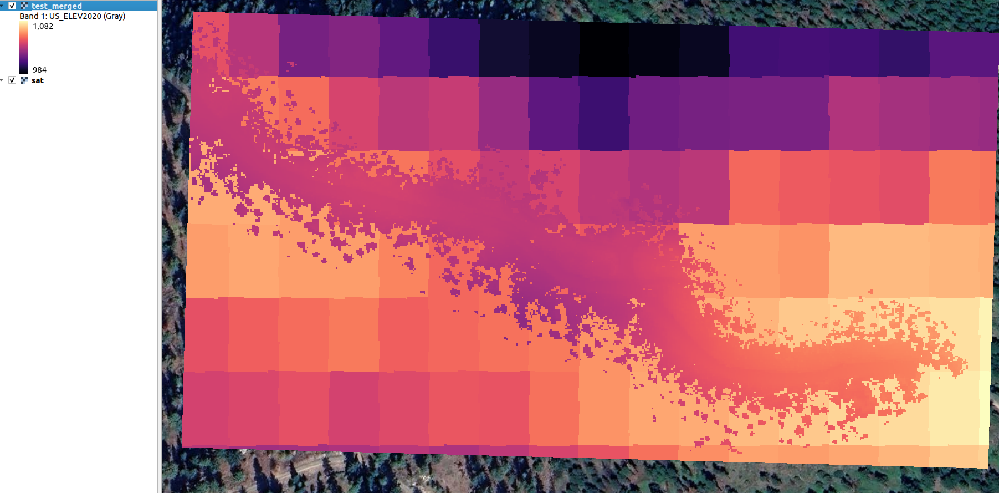

# LiDAR

This package processes georegistered LiDAR in las or laz format into data for good fire, including:

- [X] DEM tif
- [X] Aspect tif
- [X] Slope tif
- [X] Base Canopy Height Model tif
- [X] Tree ID LAS file
- [X] Diameter at Breast Height csv

## LAZ Pipeline

Place your laz file/s in the folder `data/mydataset/input/before`. Use this folder regardless of whether there is a corresponding before/after fire dataset. However, if there is a before and after, put the after-fire dataset in `data/mydataset/input/after`. If this folder doesn't exist or is empty, the script will just run the analytics that don't require before and after.

TODO: If there is a single laz file in `before/`, the script will segment it first into tiles. If there is a corresponding `after/`, the script will clip both datasets to the overlapping section and produce corresponding tiles.

## Setup

### Clone
```
cd ~/src
git clone https://github.com/robotics-88/open-goodfire-tools.git
```

### Install dependencies (Ubuntu instructions)
```
cd open-goodfire-tools/lidar
sudo ./setup.sh
```

## Usage
Run the following on your data ('mydataset'):

```
cd open-goodfire-tools/lidar
source ../.env/bin/activate
python process.py mydataset
```

To experiment with our test dataset, first download it using the provided script:
```
cd open-goodfire-tools/lidar
./scripts/download_sample.sh
```
Then run:

```
cd open-goodfire-tools/lidar
source ../.env/bin/activate
python process.py test
```

## Outputs

We assume the starting point is a before and optional after laz. The test dataset before and after looks like:



*Above: Example of "before" (left) and "after" (right) LiDAR point cloud visualizations from the test dataset.*

When before and after are both present, we can compute the **fuel volume difference**:



*Above: Visualization of computed fuel volume difference between before and after LiDAR datasets.*

All other data can be computed with only the before pointcloud.

We provide **tree segmentation**:



*Above: Example of tree segmentation output from the LiDAR pipeline.*

For data layers provided by [LANDFIRE](https://landfire.gov/), we fuse the high-resolution LiDAR data with the 30m resolution FlamMap layers from LANDFIRE. For example:

**Canopy base height**



*Above: Example of canopy base height output from the LiDAR pipeline.*

**DEM**:



*Above: Example of Digital Elevation Model (DEM) output from the LiDAR pipeline.*

## Troubleshooting

### FlamMap downloads
FlamMap often returns errors or HTML, e.g. when undergoing maintenance or capacity issues. If you have issues with the script, test using the RLandfire package in terminal.

Start an R terminal with:
```
R
```
Then:
```
library(rlandfire)
resp <- landfireAPIv2(products = "240EVC",
                    aoi = c(-105.40207, 40.11224, -105.23526, 40.19613),
                    email = "rlandfire@example.com",
                    verbose = FALSE)
```
If this works, (TODO more assistance debugging our script). If this doesn't work, there is an issue on the LANDFIRE server side that is most likely resolved by waiting and trying again later.