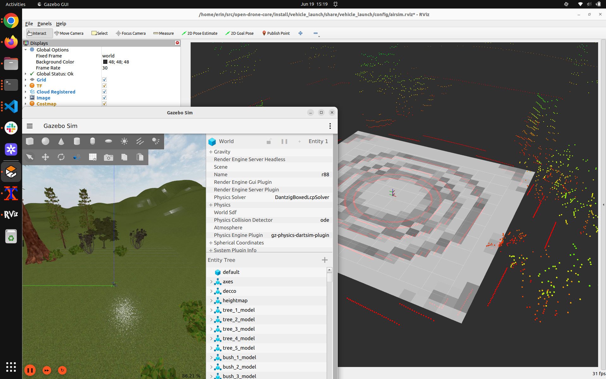
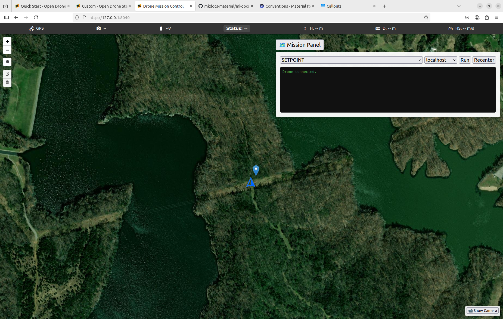

# Quick Start

## Single Script Setup -- Sim

For workspace: desktop, laptop, etc. This is a support script to install, build, and launch everything at once.

```bash
mkdir ~/src
cd ~/src
git clone https://github.com/robotics-88/open-drone-core.git
cd open-drone-core
./scripts/quickstart.sh
```

This brings up Gazebo, ArduCopter, ROS2 nodes, and the frontend, even if you start from a fresh Ubuntu install without ROS2. Should look like this when launching is complete:



### Test Setpoint Mission

Send your first setpoint mission from the frontend at [http://127.0.0.1:8040/](http://127.0.0.1:8040/) by setting the IP in the Mission Panel to localhost and dropping a pin on the map. Watch the drone take off in Rviz or Gazebo.



## Single Script Setup -- Drone

For the drone's onboard Jetson. This will clone and install everything assuming a brand new Jetson, including installing ROS2, with the assumption we are running Ubuntu 22.
```
cd
mkdir src
cd src
git clone https://github.com/robotics-88/open-drone-core.git
cd open-drone-core
./scripts/setup-drone.sh
source ~/.bashrc
```