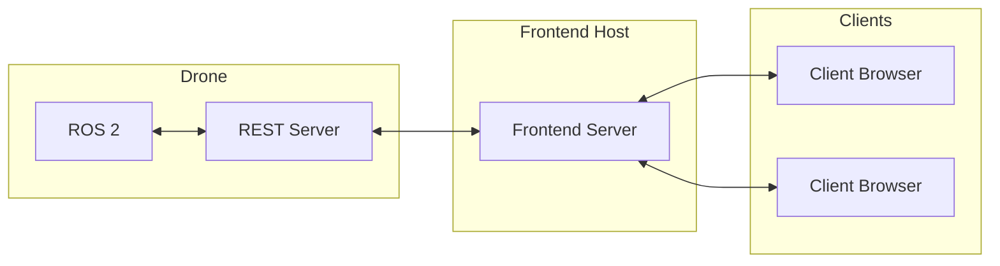

# IRL Drones

The general architecture for running the system on a real drone is shown below.

The following pages outline the steps for setting up all of the above. First we present existing compatible drones, and a list of requirements to check if your own drone is compatible. Then we proceed to setup. Briefly, the procedure is to clone and install the flight stack, define your vehicle config (i.e., your flight controller and sensors and their positions), and finally install support software (optional but recommended for ease of use).