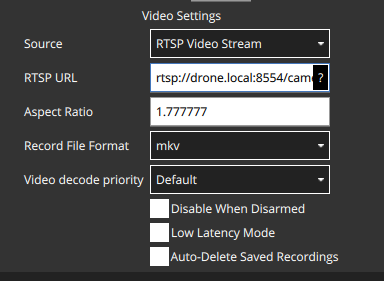

# Useful Support Software
These are support libraries we run on IRL drones to make life easier. E.g., simplify ssh, file access, video streaming, etc.

## mDNS
For convenience. This will make it so on any connected network, your drone hostname shows up as `drone.local` instead of requiring a specific IP.
```
sudo apt update
sudo apt install avahi-daemon avahi-utils
sudo hostnamectl set-hostname drone
```
And so that it starts on boot:
```
sudo systemctl enable avahi-daemon
sudo systemctl start avahi-daemon
```
From here on, instructions will assume the drone can be pinged/ssh'd at `decco@drone.local`. If you skip this step, replace this with the usual `decco@ipaddr`.

!!! tip
    If you plan to run the frontend and want to access it easily from multiple devices, you can do the same thing on your laptop, eg name it `frontend.local` so anyone can pull up the drone interface.

## Video stream
We use the mediamtx video server so we can easily switch between RTSP, WebRTC, HLS, etc.

!!! tip
    If you use the [open drone frontend](frontend.md), this stream will be automatically available in the drone interface.

Download and extract this release:
```bash
cd ~/src
mkdir video
cd video
wget https://github.com/bluenviron/mediamtx/releases/download/v1.8.1/mediamtx_v1.8.1_linux_arm64v8.tar.gz
tar -xf mediamtx_v1.8.1_linux_arm64v8.tar.gz
```

Change the RTSP params:
```bash
cd ~/src/video
nano mediamtx.yml
```

Scroll to the end and change the `paths` section to read:
```bash
paths:
  camera:
    runOnDemand: ffmpeg -f v4l2 -i /dev/video0 -pix_fmt yuv420p -c:v libx264 -preset ultrafast -tune zerolatency -b:v 1M -f rtsp rtsp://localhost:$RTSP_PORT/$MTX_PATH
    runOnDemandRestart: yes
```
!!! note
    It's better if the device is symlinked, add instructions on that later TODO.

To test if the stream is working, run with:
```bash
./mediamtx
```

After confirming, set up a systemd service so the stream starts automatically on boot.

### Start on Boot
```bash
cd ~/src/video
sudo cp mediamtx /usr/local/bin/
sudo cp mediamtx.yml /usr/local/etc/
sudo nano /etc/systemd/system/mediamtx.service
```
In the service file, paste:
```bash
[Unit]
Description=Drone Video Stream
Wants=network.target
[Service]
ExecStart=/usr/local/bin/mediamtx /usr/local/etc/mediamtx.yml
[Install]
WantedBy=multi-user.target
```

Now enable the service:
```bash
sudo systemctl daemon-reload
sudo systemctl enable mediamtx.service
sudo systemctl start mediamtx.service
```

### View Stream
The easiest place to test is in our [frontend](frontend.md), which automatically connects and displays the stream. For an alternate, you can use QGroundControl. In Application Settings, enable the video stream and set the RTSP stream to `rtsp://drone.local:8554/camera` like so:


## File Manager