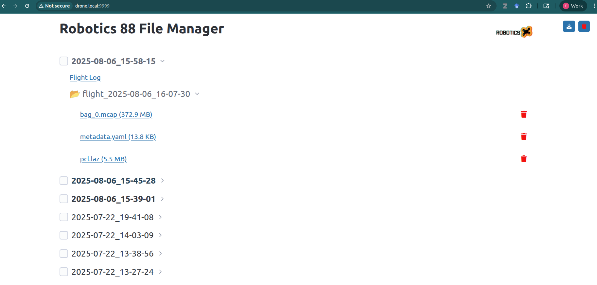

# Useful Support Software
These are support libraries we run on IRL drones to make life easier. E.g., simplify ssh, file access, video streaming, etc. Note that all of these are set up by default if you use the [quickstart](../../quickstart.md) script. If instead you want to manually install them, instructions follow.

## mDNS
This will make it so on any connected network, your drone hostname shows up as `drone.local` instead of requiring a specific IP.
```
sudo apt update
sudo apt install avahi-daemon avahi-utils
sudo hostnamectl set-hostname drone
```
And so that it starts on boot:
```
sudo systemctl enable avahi-daemon
sudo systemctl start avahi-daemon
```
From here on, instructions will assume the drone can be pinged/ssh'd at `decco@drone.local`. If you skip this step, replace this with the usual `decco@ipaddr`.

!!! tip
    If you plan to run the frontend and want to access it easily from multiple devices, you can do the same thing on your laptop, eg name it `frontend.local` so anyone can pull up the drone interface.

## Video stream
We use the mediamtx video server so we can easily switch between RTSP, WebRTC, HLS, etc.

!!! tip
    If you use the [open drone frontend](frontend.md), after setup, this stream will be automatically available in the drone interface.

Download and extract this release:
```bash
cd ~/src
mkdir video
cd video
wget https://github.com/bluenviron/mediamtx/releases/download/v1.8.1/mediamtx_v1.8.1_linux_arm64v8.tar.gz
tar -xf mediamtx_v1.8.1_linux_arm64v8.tar.gz
```

Change the RTSP params:
```bash
cd ~/src/video
nano mediamtx.yml
```

Scroll to the end and change the `paths` section to read:
```bash
paths:
  camera:
    runOnDemand: ffmpeg -f v4l2 -i my_video_device -pix_fmt yuv420p -c:v libx264 -preset ultrafast -tune zerolatency -b:v 1M -f rtsp rtsp://localhost:$RTSP_PORT/$MTX_PATH
    runOnDemandRestart: yes
```
Replace `my_video_device` as needed e.g. with `/dev/video0/` or preferably, a symlink. It's better if the device is symlinked in case video devices get reordered on boot. Default devices (mapir, immervision, and seek cameras) get symlinks created by running the [quickstart](../../quickstart.md) script. If adding your own device, create a symlink by:

```bash
lsusb
```
Output should be e.g.
```bash
Bus 001 Device 004: ID 0603:8612 Novatek Microelectronics Corp. MAPIR
```
Make a file `drone-99.rules` and copy this into it:
```bash
ACTION=="add", SUBSYSTEM=="video4linux", ATTRS{idVendor}=="0603", ATTRS{idProduct}=="8612", ATTR{index}=="0", SYMLINK+="mapir"
```
The symlink arg can be whatever you choose. Then create the symlink with:
```bash
sudo cp drone-99.rules /etc/udev/rules.d/
sudo udevadm control --reload-rules && sudo udevadm trigger
```

To test if the stream is working, run with:
```bash
./mediamtx
```

After confirming, set up a systemd service so the stream starts automatically on boot.

### Start on Boot
```bash
cd ~/src/video
sudo cp mediamtx /usr/local/bin/
sudo cp mediamtx.yml /usr/local/etc/
sudo nano /etc/systemd/system/mediamtx.service
```
In the service file, paste:
```bash
[Unit]
Description=Drone Video Stream
Wants=network.target
[Service]
ExecStart=/usr/local/bin/mediamtx /usr/local/etc/mediamtx.yml
[Install]
WantedBy=multi-user.target
```

Now enable the service:
```bash
sudo systemctl daemon-reload
sudo systemctl enable mediamtx.service
sudo systemctl start mediamtx.service
```

### View Stream
The easiest place to test is in our [frontend](frontend.md), which automatically connects and displays the stream. For an alternate, you can use QGroundControl. In Application Settings, enable the video stream and set the RTSP stream to `rtsp://drone.local:8554/camera` like so:


## File Manager

We provide a file manager service that enables easy file transfer from flight data (videos, pointclouds, logs, ROS2 mcaps). This is a service that runs on the drone but can be accessed through the browser on a device on the same network. Setup using the standalone script:

```bash
cd ~/src/open-drone-core
./scripts/steps/07-file-manager.sh
```

 The files are then accessible at [`http://drone.local:9999`](http://drone.local:9999). It should look like:
