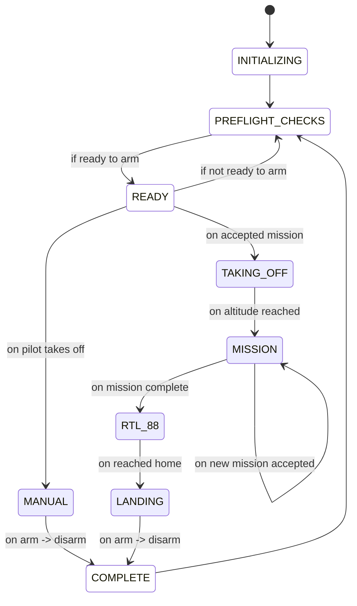

# task manager: state machine

The primary control loop is the state machine in the task manager node. This state machine is described in the diagram below:

## states
describe all

## events
describe all