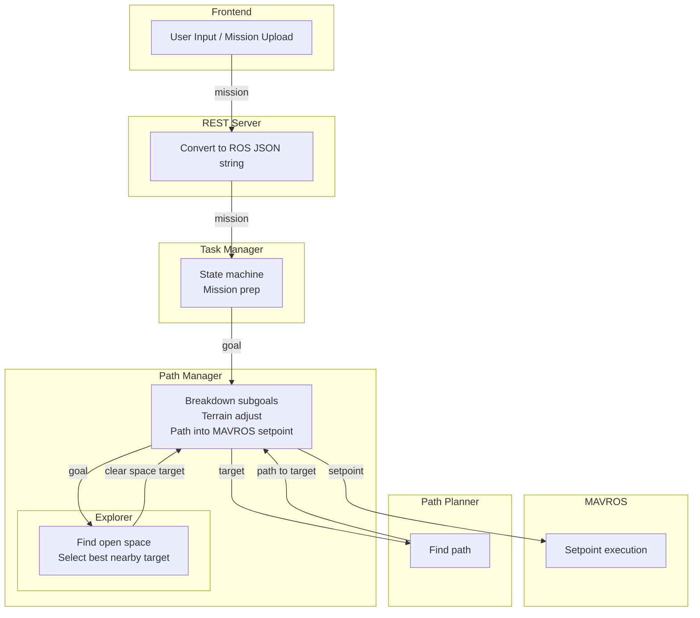

# Data Flow

Rather than look  at all data flowing through the system at once, it's easier to look at diagrams for specific data flows. On this page we provide diagrams for the 2 most critical data types, historically: navigation points and pointclouds.

## Navigation Points

We use 3 different types of navigation points: Goals, targets, and setpoints. Each indicates increasing granularity. For example, a goal could be a pin dropped on the frontend map (called SETPOINT mission in the interface, maybe we should rename it). Then short-range targets are created in path manager as subgoals. This is because path planning and obstacle avoidance is more effective on short distances. This subgoal could be sent directly to path planner, but if explorer is enabled, first path manager will try to find a destination near the subgoal but far from obstacles (or whatever other decision-making criteria you implement, see [Decision-Making](../development/decisionmaking.md)). Either way, the subgoal is the target for the path planner. When path manager receives the resulting path, it breaks that down into even smaller MAVROS-ingestible setpoints, called such because the MAVROS topic is `/mavros/setpoint_raw/local`.

TODO add image example of nav point types

## Pointclouds