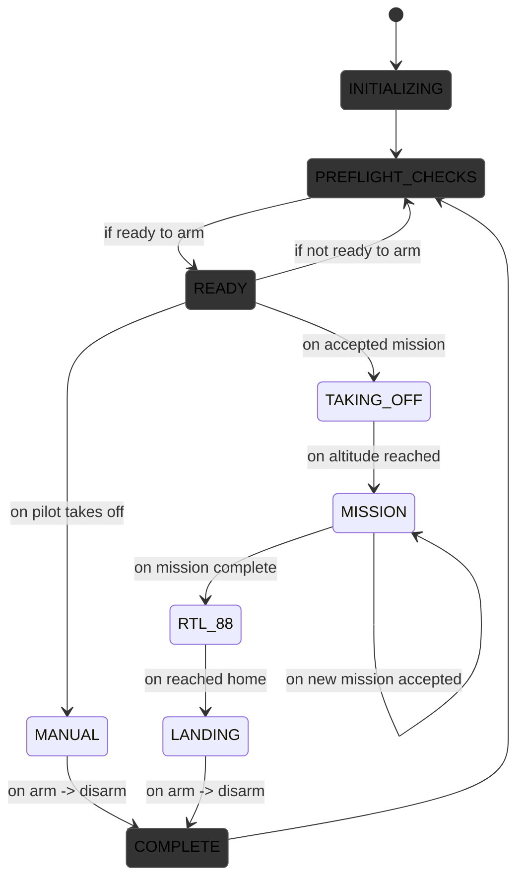

# Task Manager: State Machine

The primary control loop is the state machine in the task manager node. This state machine is described in the diagram below:

## States
States are defined by the `TaskManager::Task` enum and include the following:

* **INITIALIZING**  
   The system is powering up and performing initial setup.

* **PREFLIGHT_CHECKS**  
   Pre-flight checks are performed by the onboard flight controller to ensure the system is ready for operation.

* **READY**  
   The system is ready to arm and begin flight operations.

* **MANUAL_FLIGHT**  
   The drone is under direct manual control by the pilot.

* **PAUSE**  
   The mission or flight is temporarily paused by the user.

* **MISSION**  
   The drone is executing an autonomous mission.

* **RTL_88**  
   Return-to-launch sequence is active (RTL). RTL_88 uses the obstacle-aware path planner and DEM when available, in contrast to the PX4/ArduPilot RTL methods.

* **TAKING_OFF**  
   The drone is in the process of taking off.

* **LANDING**  
   The drone is landing.

* **FAILSAFE_LANDING**  
   The drone is performing a failsafe landing due to an error or safety trigger.

* **COMPLETE**  
   The flight or mission has ended, and the system is disarmed.

## Events
Events cause the state machine to change states.

* **FLIGHT CONTROLLER CHECKS PASS/FAIL**  
   The onboard flight controller checks pass, then the state moves to READY. If they fail, the state is PREFLIGHT_CHECKS.

* **FRONTEND MISSION RECEIVED**  
   If a mission is received and all the correct Task Manager integration is complete, MISSION state is activated.

* **AUTONOMY ALTITUDE REACHED**  
   Missions can only be activated after takeoff once the user-defined altitude volume is reached.

* **PILOT TAKEOFF**  
   The drone detects takeoff without a mission, not in guided mode.

* **FRONTEND EMERGENCY BUTTON**  
   The 3 frontend emergency buttons result in 3 separate possible states: PAUSE, RTL_88, and FAILSAFE_LANDING.

* **MISSION COMPLETE**  
   On completing the mission (e.g., setpoint reached, lawnmower points all completed), the drone enters hover mode and sets state to READY.

* **AUTOMATIC FAILSAFE TRIGGERED**  
   Any of the failsafes can be automatically detected and interrupt a lower priority state, moving to FAILSAFE_LANDING.